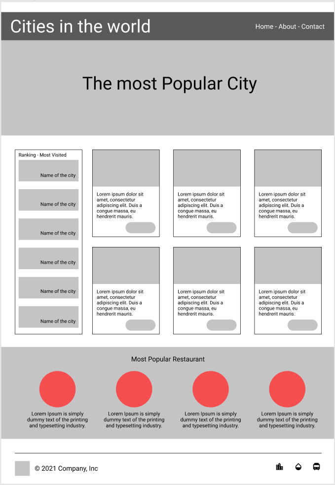
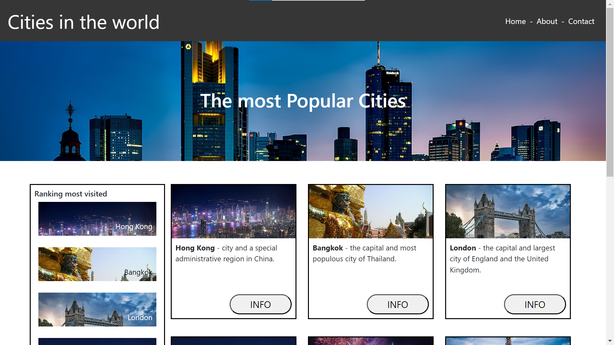
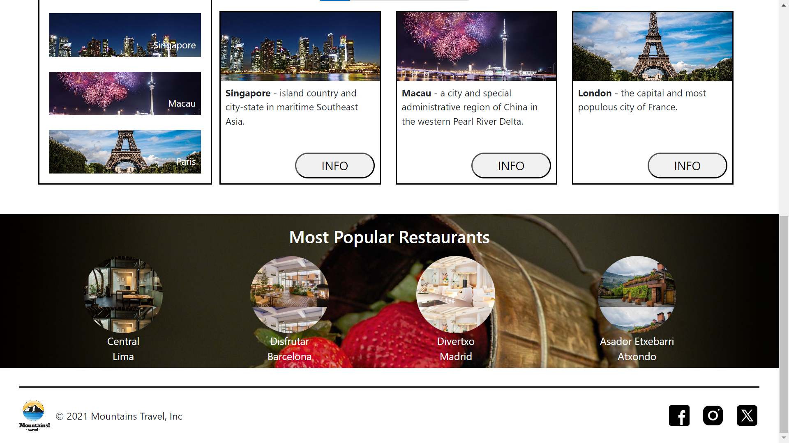

# Cities in the world project with Bootstrap and Vite

Hi! This is an exercise by Factoría F5. The goal was to using a sketch provided to us, create a web page using Bootstrap in order to learn how to use it. 

## Original sketch 



## Screenshots





## Project Setup

```sh
npm install
npm i --save bootstrap @popperjs/core
```

## Compile and Hot-Reload for Development

```sh
npm run start
```

## Compile and Minify for Production

```sh
npm run build
```

## DEV DEPENDENCIES

- Vite [https://vitejs.dev/]
- Sass [https://sass-lang.com/]

## OTHER DEPENDENCIES

Bootstrap, PopperJS [https://getbootstrap.com/docs/5.2/getting-started/vite/]

### Thank you for visiting this repository!